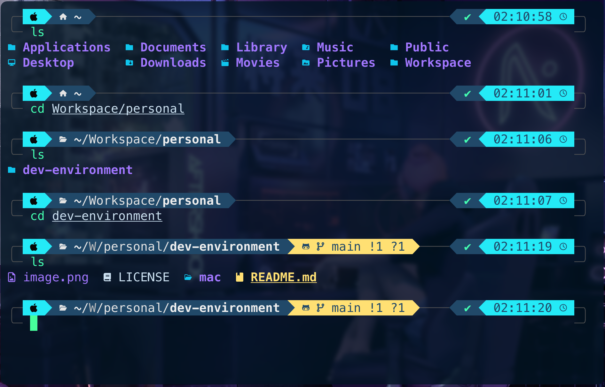

# Development Environment

This repository uses all the terminal, code editor, extensions, etc., setup for me development environment. This contains setup for Mac, Windows and Linux operating systems. 

## Development setup for Mac

### Terminal

Using `zsh` and [Wezterm](https://wezterm.org/) as my terminal. Follow the steps to setup up a terminal that looks like the below attached screen shot of my terminal.



#### Check or Set default terminal

Open the default terminal app on macOs.

This setup is specifically for zsh (default) so make sure you are using that.

You can check by doing:

```bash
echo $0
```

You can change to zsh if you have it installed by doing:

```bash
chsh -s /bin/zsh
```

#### Install homebrew

```bash
/bin/bash -c "$(curl -fsSL https://raw.githubusercontent.com/Homebrew/install/HEAD/install.sh)"
```
If necessary, when prompted, enter your password here and press enter. If you haven’t installed the XCode Command Line Tools, when prompted, press enter and homebrew will install this as well.

#### Add To Path (Only Apple Silicon Mac)

After installing, add it to the path. This step shouldn’t be necessary on Intel macs.

Run the following command to add the necessary line to `~/.zprofile`:

```bash
echo 'eval "$(/opt/homebrew/bin/brew shellenv)"' >> ~/.zprofile
```

Now source `~/.zprofile` by doing:

```bash
source ~/.zprofile
```

#### Install Wezterm

```bash
brew install --cask wezterm
```

#### Install Meslo Nerd Font

Nerd Fonts are great for showing icons in the terminal. I personally use Meslo Nerd Font, but there are others.

You can install a nerd font with homebrew. Take a look at the fonts in the hombrew casks repo: [homebrew-cask](https://github.com/Homebrew/homebrew-cask)

Then you can install the nerd font you’d like

```bash
brew install font-meslo-lg-nerd-font
```

#### Setup Wezterm Config File

Next we’ll setup the `~/.wezterm.lua` configuration file to configure Wezterm. This file is written in lua which is a really nice benefit of using Wezterm!

First create the config file:

```bash
touch ~/.wezterm.lua
```

Then open it with your editor of choice. I use Neovim, but you can use whatever you prefer.

To open with TextEdit:

```sh
open -a TextEdit ~/.wezterm.lua
```

#### Add the configuration to ~/.wezterm.lua

See [this](https://wezfurlong.org/wezterm/config/files.html) for the official documentation.

Add the following configuration to this file. You can modify this to suit your needs.

```lua
-- Pull in the wezterm API
local wezterm = require("wezterm")

-- This will hold the configuration.
local config = wezterm.config_builder()

-- This is where you actually apply your config choices

config.font = wezterm.font("MesloLGS Nerd Font Mono")
config.font_size = 19

config.enable_tab_bar = false

config.window_decorations = "RESIZE"

config.window_background_opacity = 0.8
config.macos_window_background_blur = 10

-- and finally, return the configuration to wezterm
return config
```

#### Choose a colorscheme

Take a look at the available colorschemes [here](https://wezterm.org/colorschemes/index.html)

Once you find one you like, you can select a colorscheme for wezterm like so (the highlighted line below):

Use this script to achieve a look equivalent to the above screenshot

```lua
-- Pull in the wezterm API
local wezterm = require("wezterm")

-- This will hold the configuration.
local config = wezterm.config_builder()

-- This is where you actually apply your config choices

config.font = wezterm.font("MesloLGS Nerd Font Mono")
config.font_size = 19

config.enable_tab_bar = false

config.window_decorations = "RESIZE"
config.window_background_opacity = 0.8
config.macos_window_background_blur = 10

-- my coolnight colorscheme:
config.colors = {
	foreground = "#CBE0F0",
	background = "#011423",
	cursor_bg = "#47FF9C",
	cursor_border = "#47FF9C",
	cursor_fg = "#011423",
	selection_bg = "#033259",
	selection_fg = "#CBE0F0",
	ansi = { "#214969", "#E52E2E", "#44FFB1", "#FFE073", "#0FC5ED", "#a277ff", "#24EAF7", "#24EAF7" },
	brights = { "#214969", "#E52E2E", "#44FFB1", "#FFE073", "#A277FF", "#a277ff", "#24EAF7", "#24EAF7" },
}

-- and finally, return the configuration to wezterm
return config
```

Save this file and go back to the command line.

#### Install powerlevel10k theme

[Powerlevel10k](https://github.com/romkatv/powerlevel10k) is an awesome theme for zsh.

Install it like so:

```bash
brew install powerlevel10k
```

Then run the following:

```bash
echo "source $(brew --prefix)/share/powerlevel10k/powerlevel10k.zsh-theme" >> ~/.zshrc
```

This will add what you need to `~/.zshrc` to enable it.

Now source `~/.zshrc`:

```bash
source ~/.zshrc
```

The powerlevel10k configuration wizard should show up now.

If you want to open the wizard manually do: `p10k configure`.

Answer the prompts to make the theme look like you would like it to.

Save this file and go back to the command line.

#### Fix directory background color

If you’re using the rainbow version of powerlevel10k, I recommend you change the directory background color from blue to black.

Open `~/.p10k.zsh` with your editor of choice. With Neovim it would be:

```bash
nvim ~/.p10k.zsh
```

And then look for `POWERLEVEL9K_DIR_BACKGROUND` and change the color from 4 to 0 like so:

```bash
typeset -g POWERLEVEL9K_DIR_BACKGROUND=0
```

#### Better zsh history completion with up, down arrows

Let’s improve the history completion with the up and down arrows.

Open `~/.zshrc` and add the following to the bottom of this file:

```bash
# history setup
HISTFILE=$HOME/.zhistory
SAVEHIST=1000
HISTSIZE=999
setopt share_history
setopt hist_expire_dups_first
setopt hist_ignore_dups
setopt hist_verify
```

This will allow zsh to save the history to a file and configure how it should do so.

Then go back to the command line and run:

```bash
cat -v
```

Now press on your up and down arrow keys.

Copy the codes that you get as output.

Open the `~/.zshrc` file again and add the following to the bottom of this file:

```bash
# completion using arrow keys (based on history)
bindkey '^[[A' history-search-backward
bindkey '^[[B' history-search-forward
```

Replace `^[[A` and `^[[B` with the key codes you got for up and down arrow keys if they are different.

#### Setup zsh-autosuggestions plugin

This plugin provides some really nice auto completion functionality as you type out commands.

Install it like so:

```bash
brew install zsh-autosuggestions
```

Then run the following:

```bash
echo "source $(brew --prefix)/share/zsh-autosuggestions/zsh-autosuggestions.zsh" >> ~/.zshrc
```

This will add what you need to `~/.zshrc`.

Now source it:

```bash
source ~/.zshrc
```

Now you can use the plugin! When you get a suggestion and want to use it, use the right arrow key.

#### Setup zsh-syntax-highlighting

This will provide some really nice syntax highlighting as you type out commands.

Install it like so:

```bash
brew install zsh-syntax-highlighting
```

Then run:

```bash
echo "source $(brew --prefix)/share/zsh-syntax-highlighting/zsh-syntax-highlighting.zsh" >> ~/.zshrc
```

This adds what you need to `~/.zshrc` to enable the plugin.

Now source `~/.zshrc`:

```bash
source ~/.zshrc
```

You should be getting the syntax highlighting now!

#### Install eza (better ls)

[eza](https://github.com/eza-community/eza) is a better version of ls with lots of different options.

Install it:

```bash
brew install eza
```

Now you can start using it!

You can create an alias for it in `~/.zshrc` like so:

```bash
# ---- Eza (better ls) -----

alias ls="eza --icons=always"
```

#### Install zoxide (better cd)

[zoxide](https://github.com/ajeetdsouza/zoxide) is an amazing alternative to cd.

It will remember the directories you’ve visited in the past and make it really easy to navigate back to them by just typing out a portion of the name of the directory you want to visit.

Install it like so:

```bash
brew install zoxide
```

Then add the following to `~/.zshrc`:

```bash
# ---- Zoxide (better cd) ----
eval "$(zoxide init zsh)"
```

If you want to keep using `cd` then create an alias in `~/.zshrc`:

```bash
# ---- Zoxide (better cd) ----
eval "$(zoxide init zsh)"

alias cd="z"
```

Save and then run:

```bash
source ~/.zshrc
```

Now you can use `z` as a much smarter replacement to `cd`.

