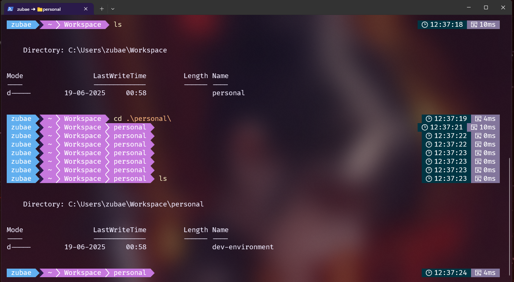

# Development Environment

This repository uses all the terminal, code editor, extensions, etc., setup for me development environment. This contains setup for Mac, Windows and Linux operating systems.

## Development setup for Mac

### Mac Terminal

Using `zsh` and [Wezterm](https://wezterm.org/) as my terminal. Follow the steps mentioned in [WEZTERM.md](/mac/WEZTERM.md) setup up a terminal that looks like the below attached screen shot of my terminal.

## Development setup for Windows

### Windows Terminal

Using `oh my posh` to customize my terminal's appearance. I generally done use Windows to program. I have a `WSL` `ubuntu` running, I connect remotely to it with my code editor. I will list down `WSl` setup too. Follow the steps mentioned in [TERMINAL.md](/windows/TERMINAL.md).

